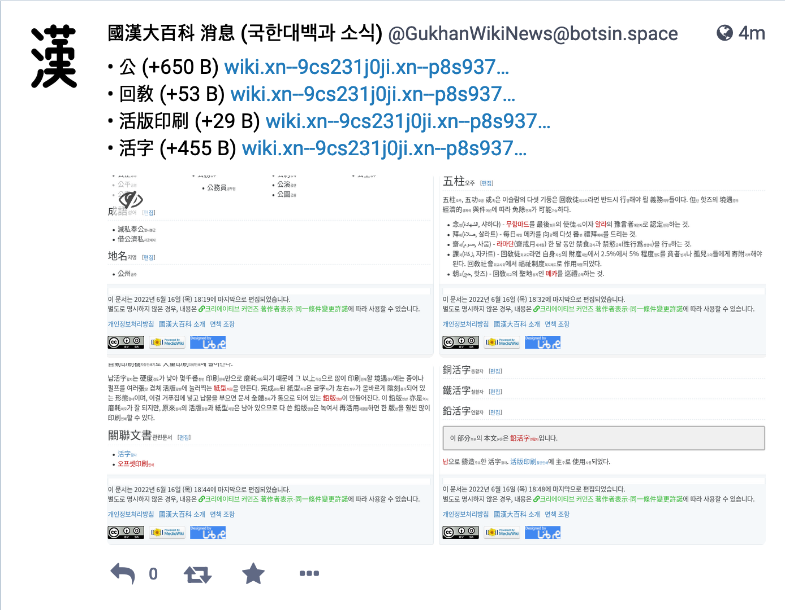

<!-- deno-fmt-ignore-file -->

 mediawiki-rc-mastodon-bot
=======================================

This small program continuously relays RecentChanges from a MediaWiki site
to a Mastodon account.  Each toot will contain up to 4 items with their
screenshots.  The following toot is an example:

Prerequisites
-------------

 1.  Install [Deno] 1.23.0 or above.

 2.  You need a MediaWiki site.  It doesn't have to be owned by you, but you
     should be allowed to redistribute their page titles, permalinks, and their
     screenshots to public social media.
 
     *Base URL* will be used.  Note that MediaWiki base URLs usually do not
     include paths like `wiki/` and `w/`.

 3.  Create a Mastodon account.  I recommend [botsin.space], a Mastodon server
     specialized for bots, but you can use any other Mastodon server too, except
     automatical tooting is allowed according to the rules of your server.

 4.  Create a Mastodon application from *Preferences* → *Development* →
     *New Application*.  It requires 3 access scopes:

      -  `read:statuses`
      -  `write:media`
      -  `write:statuses`

     *Application name* and *Redirect URI* do not matter as they are unused.

     *Your access key* will be used.

 5.  Optionally, you may need a [Browserless] account, if you can't or don't
     want to run a headless web browser on your own node (e.g., [Deno Deploy]).
     Don't worry! Browserless offers some prepaid balance for free.

     *API Key* will be used.

[Deno]: https://deno.land/
[botsin.space]: https://botsin.space/
[Browserless]: https://www.browserless.io/
[Deno Deploy]: https://deno.com/deploy

Usage
-----

Here's a command to run with minimum options:

~~~~ bash
deno run --allow-all --unstable --config=deno.jsonc --lock=lock.json main.ts \
  https://your-mediawiki-site.wiki/ \
  https://your-mastodon-server.social/ \
  --mastodon-access-token=YOUR_MASTODON_ACCESS_KEY \
  --continue \
  --limit=16
~~~~

If you want to use Browserless instead of your local web browser for capturing
screenshots, use `--browser-ws-endpoint` option:

~~~~ bash
deno run --allow-all --unstable --config=deno.jsonc --lock=lock.json main.ts \
  https://your-mediawiki-site.wiki/ \
  https://your-mastodon-server.social/ \
  -a YOUR_MASTODON_ACCESS_KEY -C -l 16 \
  --browser-ws-endpoint wss://chrome.browserless.io?token=BROWSERLESS_API_KEY
~~~~

For further options, use `-h`/`--help` option.

License
-------

Distributed under [AGPL 3.0] or later.

[AGPL 3.0]: https://www.gnu.org/licenses/agpl-3.0.html
